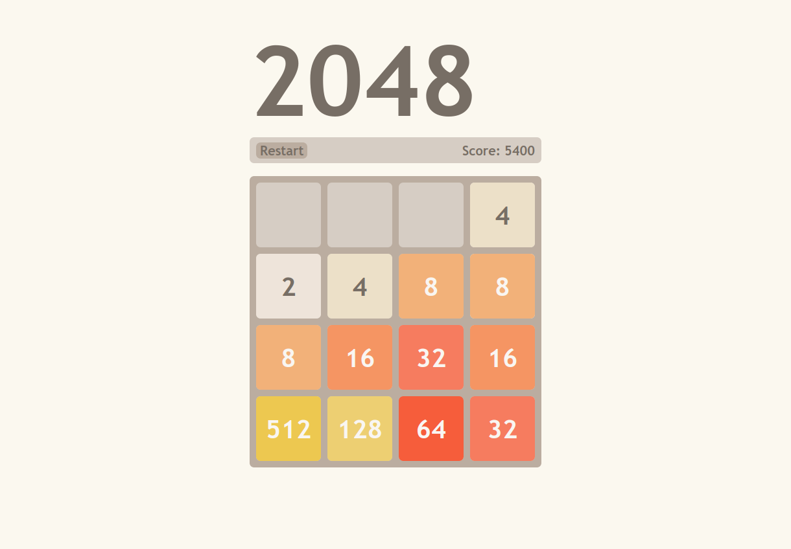

# 2048

Implementation of the puzzle game 2048 with javascript and CSS keyframe animations.

To play, download the project directory, open game.html in a web browser
and use the arrow keys to move the tiles.
